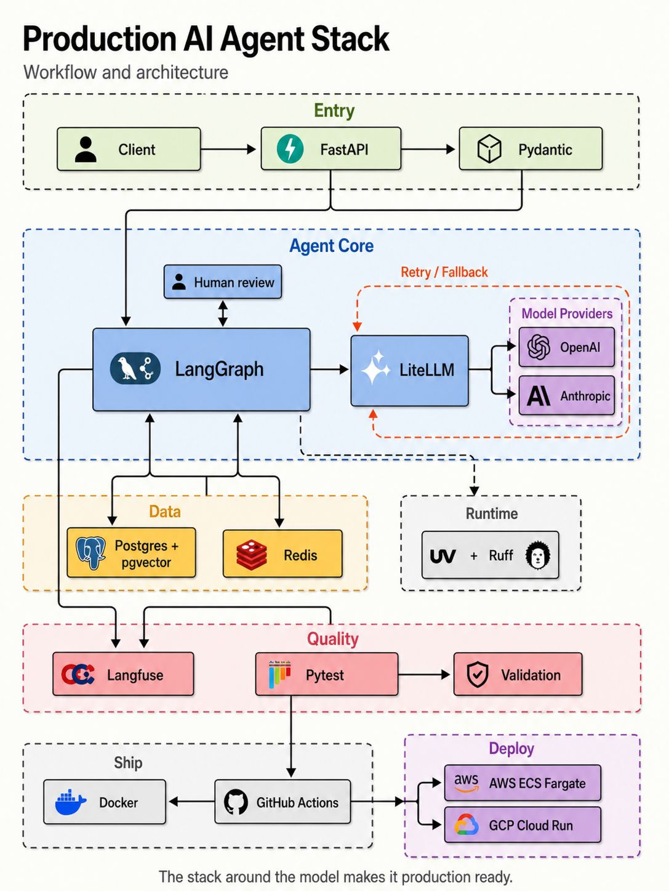

# Taking an AI Agent from Prototype to Production: A Practical, Python-First Stack

*Most agents die in production. Here's the engineering around the model that keeps them alive.*

---

Building an AI agent is easy.

> Building one that survives production is a completely different problem.

A production AI agent needs more than a powerful LLM. It needs the right engineering stack **around the model** — orchestration, data, observability, testing, deployment, and runtime. Here's the eight-layer, Python-first stack that takes one from prototype to a system you can actually rely on.

---

## The Stack at a Glance

> **The stack around the model makes it production ready.**

---

## The Eight Layers

### 🟢 1. API & Validation — FastAPI + Pydantic

FastAPI gives you the async HTTP layer with dependency injection and OpenAPI docs for free. Pydantic validates requests, responses, and — critically — structured LLM outputs, so a free-form model response becomes a typed object before it touches your business logic. Pass a `model_json_schema()` to the model and never parse text with regex again.

### 🔵 2. Agent Orchestration — LangGraph

A prototype is a `while tool_call: llm.chat()` loop. Production needs a declarative DAG: typed state, persisted checkpoints, first-class tools, conditional branches, and human-in-the-loop interrupts. Make every node **idempotent** so retries don't double-fire side effects, and checkpoint state to durable storage so a half-finished run never gets lost.

### 🟡 3. Data & State — PostgreSQL + pgvector + Redis

Postgres + pgvector keeps application data, audit logs, and embeddings in one transactional store — the vector row lives next to the metadata that owns it, so no sync drift. Redis handles caching, rate limiting, and short-lived conversation state. Treat embedding backfills like schema migrations: slow, reproducible, and re-runnable.

### 🟣 4. LLM Gateway — LiteLLM

Don't couple your application to one provider. LiteLLM gives you a unified interface with retries, fallbacks, and provider switching by config — if OpenAI is down, route to Anthropic; if Anthropic 429s, route to a self-hosted model. **Pin model versions.** `gpt-5-latest` is how you wake up to a 3 a.m. incident.

### 🔍 5. Observability & LLMOps — Langfuse (or Opik)

Agents are non-deterministic and multi-step. Without traces, "the agent is broken" becomes a customer complaint. Track every LLM call — prompt, completion, model, latency, tokens, cost — alongside the full graph execution, including tool calls and conditional branches. Sample 100% of errors, 1–10% of successes, and treat trace IDs as first-class in your logs.

### ⚡ 6. Development Tooling — uv + Ruff + Pytest

uv for dependency management and lockfiles, Ruff for lint + format (one Rust binary replaces flake8, isort, black), Pytest for tests. Wire all three into pre-commit and CI, and block merges on any failure. Keep **evals** distinct from **tests**: tests assert deterministic contracts, evals measure quality on a golden dataset.

### 📦 7. Containerization & Deployment — Docker + GitHub Actions

Docker makes the artifact identical from laptop to prod; GitHub Actions makes the path from commit to deploy a reproducible pipeline. Multi-stage builds, **pinned base image digests** (not tags), and deploys gated by passing tests — never by humans clicking buttons.

### ☁️ 8. Production Runtime — AWS ECS Fargate / GCP Cloud Run

Serverless containers give you reproducibility and isolation without the operational cost of Kubernetes. Pick by workload shape: **bursty HTTP** → Cloud Run (scale-to-zero, dead simple), **steady long-running agents** → ECS Fargate (VPC-native, IAM-integrated). Always set max-scale. A bug plus unbounded scale equals the bill that ends the project.

---

## Production Readiness, in One Pass

Before you call an agent production-ready, every box must be checkable:

- **Reliability** — nodes idempotent; state checkpointed; LLM calls behind a gateway with retries and fallback; timeouts on every external call.
- **Observability** — 100% of LLM calls traced; trace IDs in logs; cost per run alertable; feedback joinable to traces.
- **Data** — embeddings next to the rows they describe; vector queries indexed; ephemeral state in Redis only.
- **Quality** — offline eval on every PR; online monitor for drift; lint and tests blocking merges.
- **Deployment** — pinned base image digest; secrets injected at runtime; deploys gated by tests; max-scale set.
- **Security** — every input validated at the edge; tool calls scoped and authorized; auth at the HTTP layer.

---

## The Part Most People Skip

The LLM is one component of an AI agent. The model gets the attention. The engineering around it does the work.

> **Model + orchestration + data + observability + testing + deployment = Production AI Agent**

Pick the layers. Wire them in order. Ship.

*— Originally published on Medium.*